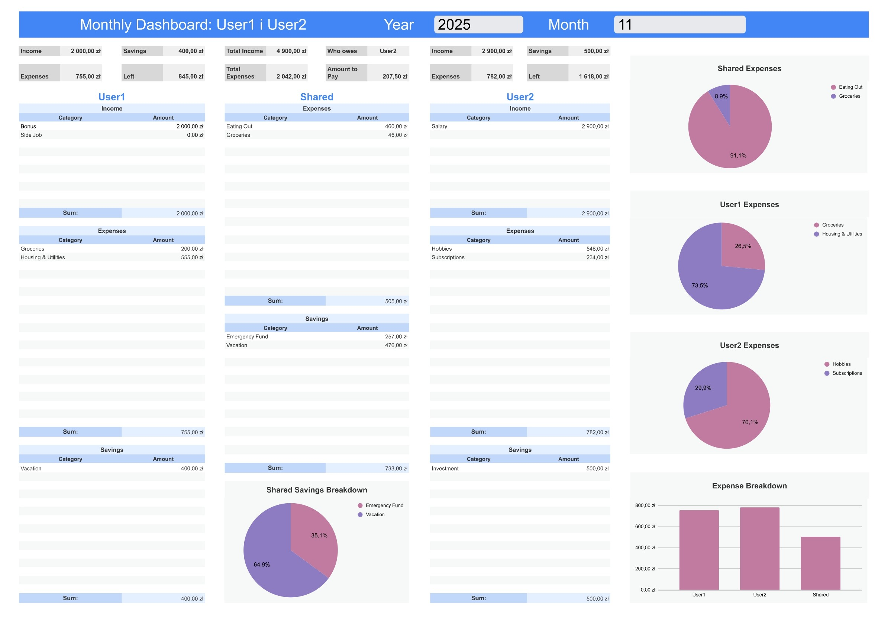
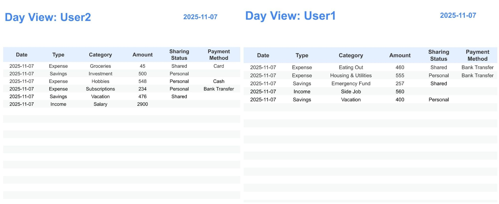
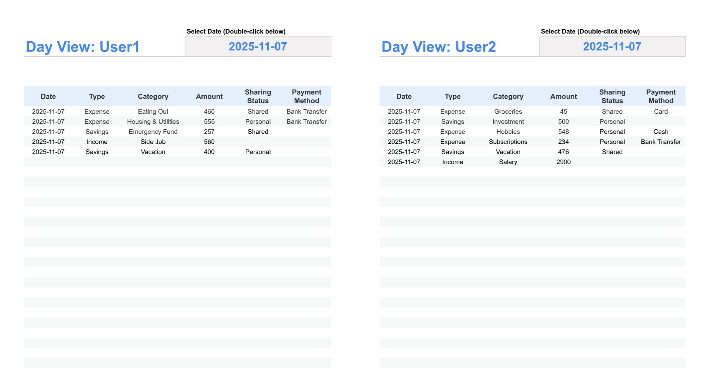

# Google Sheets Budget & Expense Management System

---

## Project in Action (Demo)

Here is the system's data pipeline in action: data is entered in the Form and instantly updates the Monthly Dashboard.

BRAKUJE

---

## About This Project

This is a comprehensive, bilingual (PL/EN) financial tracking system designed for partners or roommates. It's built entirely within the Google ecosystem (Sheets & Forms) and automates the entire process from data entry on a phone to complex annual analysis.

The system is designed not just for tracking, but for advanced settlement logic, allowing users to define custom percentage splits (e.g., 60/40) for shared expenses and automatically calculating who owes whom.

---

## Live Links

* **[View the LIVE English Template (View-Only)](https://docs.google.com/spreadsheets/d/1aysc-xIUi3Xp7zyUFXg2SKp_hGLKmCBxVI6fM1Gf66A/edit?usp=sharing)**
* **[View the LIVE Polish Template (View-Only)](https://docs.google.com/spreadsheets/d/1JNQPLIjrv3KQSINDWVn4Xvu99-NEaKsMITFb2p0hGvs/edit?usp=sharing)**

---

## Core Features

* **Automated Data Pipeline:** A Google Form acts as a mobile app for quick data entry. Submissions are instantly sent to a raw data sheet (`FormResponses`), which is then automatically cleaned, transformed, and unified by a master `QUERY` function into a `CleanData` database.
* **Dynamic Dashboards (Monthly & Annual):** Fully interactive dashboards that filter all data based on user-selected year and month.
* **Advanced Settlement Logic:** A "who owes whom" feature powered by a single `LET` formula. It calculates the precise amount owed based on:
    * A custom percentage split (e.g., 50/50, 60/40) defined in a `Config` panel.
    * `SUMIFS` formulas that aggregate only "Shared" expenses for each user.
* **Tri-Panel Analysis:** The dashboards are split into three logical panels (User 1, Shared, User 2) for clear, segregated analysis of private vs. shared finances.
* **Phone-Optimized "Daily View":** Separate, lightweight sheets designed to be phone shortcuts. They automatically show *only* today's entries for that specific user, preventing duplicate data entry.
* **Bilingual & Flexible:** The entire system is duplicated in two versions (Polish & English), demonstrating scalability. A `Config` (Ustawienia) sheet allows users to change names and settings without breaking formulas.

---

## Technical Deep Dive & Skills Demonstrated

This project showcases skills beyond simple spreadsheet functions:

* **Data Transformation (ETL):** Using a single, complex `QUERY` function to merge data from 11+ "dirty" source columns (from the form) into 8 clean, chronologically sorted columns in the `CleanData` sheet.
* **Advanced Formulas (Logical & Resilient):**
    * **`LET`:** Used to build the entire settlement logic in a single, readable formula, preventing the need for dozens of helper cells.
    * **`FILTER` + `UNIQUE`:** Used to dynamically generate all category lists for the dashboards.
    * **`ARRAYFORMULA` + `SUMIFS`:** Used to create "spill-down" sum tables that automatically match the dynamic category lists.
    * **`IFERROR` & `TRIM` / `LIKE`:** Formulas are made "bulletproof" to handle empty data (e.g., no income in a given month) and user error (e.g., hidden spaces in data entries).
* **System Architecture:** Designing a multi-sheet system where data flows logically from entry (Form) -> storage (`Odpowiedzi`) -> transformation (`CzysteDane`) -> configuration (`Ustawienia`) -> presentation (`Dashboard`).
* **UX/UI Design:** Applying a strict Style Guide (custom color palette, typography, hidden gridlines) and designing user-centric tools (like the "Daily View" and the "Day Finder") to solve specific user problems.

## Screenshots

### Monthly Dashboard (Main View)

### Annual Dashboard (Trend Analysis)

### Daily View (Phone Shortcut) & Day Finder

